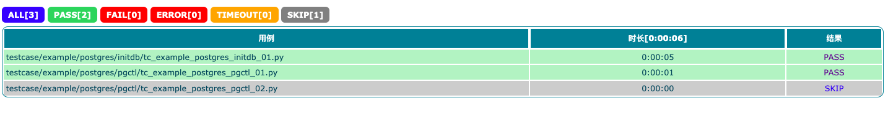
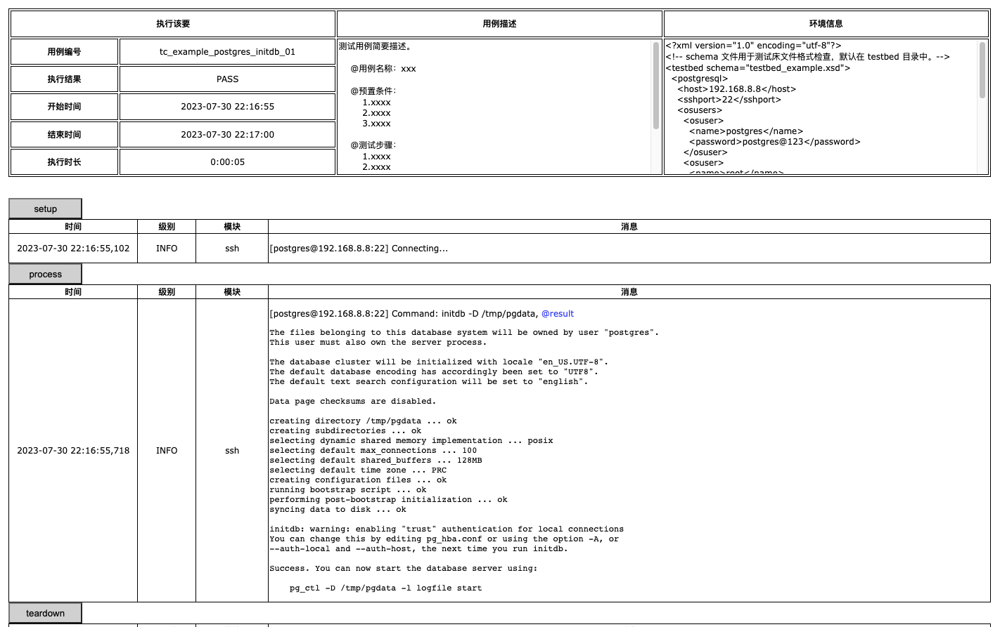

xbot 是一个基础自动化测试框架，使用者可根据需要对 lib 库和 testbed 进行扩展以满足实际需求。

安装步骤：

```
$ git clone https://github.com/zhaowcheng/xbot.git
$ cd xbot && pip install -r requirements.txt
$ python3 xbot.py --help
```

命令帮助：

```console
$ python3 xbot.py --help
Usage: xbot.py [OPTIONS] COMMAND [ARGS]...

Options:
  -h, --help     Show this message and exit.
  -v, --version  Show the version and exit.

Commands:
  runcases  Run testcases.

$ python3 xbot.py runcases --help
Usage: xbot.py runcases [OPTIONS]

  Run testcases.

Options:
  -b, --testbed TEXT  Testbed file path.  [required]
  -s, --testset TEXT  Testset file path.  [required]
  --help              Show this message and exit.

Examples:
  python xbot.py runcases -b testbed/mytestbed.xml -s testset/mytestset.xml
```

测试床(testbed)配置示例：

```xml
<?xml version="1.0" encoding="utf-8"?>
<!-- schema 文件用于测试床文件格式检查，默认在 testbed 目录中。-->
<testbed schema="testbed_example.xsd">
  <postgresql>
    <host>192.168.8.8</host>
    <sshport>22</sshport>
    <osusers>
      <osuser>
        <name>postgres</name>
        <password>postgres@123</password>
      </osuser>
      <osuser>
        <name>root</name>
        <password>root@123</password>
      </osuser>
    </osusers>
    <pghome>/home/postgres/pg14</pghome>
    <pgdata>/home/postgres/pg14/data</pgdata>
    <pgport>5432</pgport>
    <dbname>postgres</dbname>
    <dbusers>
      <dbuser>
        <name>postgres</name>
        <password>postgres@123</password>
      </dbuser>
    </dbusers>
  </postgresql>
</testbed>
```

测试套(testset)配置示例：

```xml
<?xml version="1.0" encoding="utf-8"?>
<testset>
  <tags>
    <!-- 执行 TAGS 属性中包含 'tag1' 或 'tag2' 的用例-->
    <tag>tag1</tag>
    <tag>tag2</tag>
  </tags>
  <paths>
    <!-- 
      .py 结尾的当作用例路径，否则当作目录路径并递归执行该目录下所有用例。
      无论在在什么系统上，路径分隔符均使用 '/'，且以 testcase 开头。
    -->
    <path>testcase/example/postgres/initdb/tc_example_postgres_initdb_01.py</path>
    <path>testcase/example/postgres/pgctl/</path>
  </paths>
</testset>
```

运行示例：

```console
$ python3 xbot.py runcases -b testbed/testbed_example.xml -s testset/testset_example.xml
[2023-07-30 22:16:55,096] [INFO] [MainThread] [runner] === Start: testcase/example/postgres/initdb/tc_example_postgres_initdb_01.py ===
[2023-07-30 22:16:55,102] [INFO] [tc_example_postgres_initdb_01] [ssh] [postgres@192.168.8.8:22] Connecting...
[2023-07-30 22:16:55,718] [INFO] [tc_example_postgres_initdb_01] [ssh] [postgres@192.168.8.8:22] Command: initdb -D /tmp/pgdata
[2023-07-30 22:17:00,316] [INFO] [MainThread] [runner] ==== End: testcase/example/postgres/initdb/tc_example_postgres_initdb_01.py ====

[2023-07-30 22:17:00,316] [INFO] [MainThread] [runner] ==== Start: testcase/example/postgres/pgctl/tc_example_postgres_pgctl_01.py ====
[2023-07-30 22:17:00,318] [INFO] [tc_example_postgres_pgctl_01] [ssh] [postgres@192.168.8.8:22] Command: pg_ctl start -D /tmp/pgdata
[2023-07-30 22:17:00,648] [INFO] [tc_example_postgres_pgctl_01] [ssh] [postgres@192.168.8.8:22] Command: pg_ctl status -D /tmp/pgdata
[2023-07-30 22:17:00,900] [INFO] [tc_example_postgres_pgctl_01] [ssh] [postgres@192.168.8.8:22] Command: pg_ctl stop -D /tmp/pgdata
[2023-07-30 22:17:01,250] [INFO] [tc_example_postgres_pgctl_01] [ssh] [postgres@192.168.8.8:22] Command: rm -rfv /tmp/pgdata
[2023-07-30 22:17:01,645] [INFO] [MainThread] [runner] ===== End: testcase/example/postgres/pgctl/tc_example_postgres_pgctl_01.py =====

[2023-07-30 22:17:01,645] [INFO] [MainThread] [runner] ==== Start: testcase/example/postgres/pgctl/tc_example_postgres_pgctl_02.py ====
[2023-07-30 22:17:01,646] [WARNING] [MainThread] [runner] Skipped because dont contain any tag of ['tag1', 'tag2'].
[2023-07-30 22:17:01,657] [INFO] [MainThread] [runner] ===== End: testcase/example/postgres/pgctl/tc_example_postgres_pgctl_02.py =====


Generating report...  /xbot/log/testbed_example/2023-07-30_22-16-55/report.html
```

报告示例：


日志示例：
